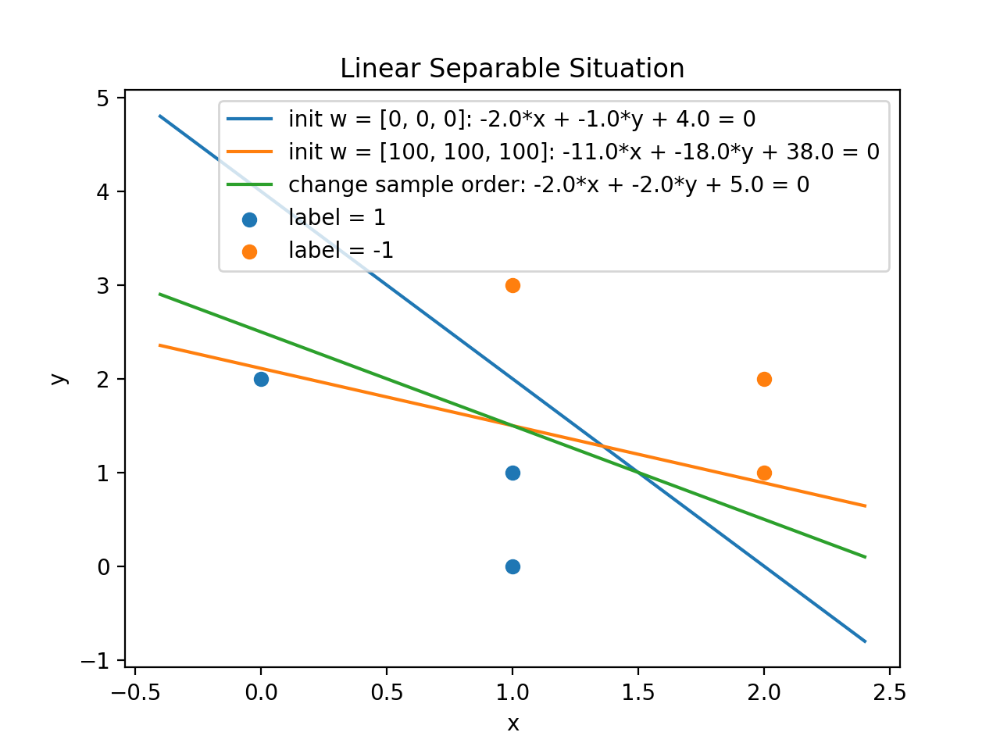
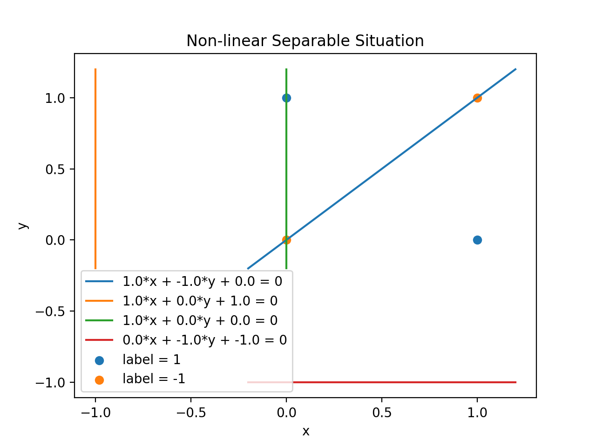

# 实验一 固定增量法求分界面

## 实验目的

1. 了解感知机算法
2. 实现感知机算法
3. 认识感知机算法的优点和局限性

## 实验要求

1. 已知二维模式样本集 $X_1=\left\{\begin{pmatrix}1\\0\end{pmatrix},\begin{pmatrix}1\\1\end{pmatrix},\begin{pmatrix}0\\2\end{pmatrix}\right\}$, $X_2=\left\{\begin{pmatrix}2\\1\end{pmatrix},\begin{pmatrix}2\\2\end{pmatrix},\begin{pmatrix}1\\3\end{pmatrix}\right\}$，用固定增量算法求分界面方程，并作图.
2. 分别改变初始权向量和样本集中的样本顺序来获得不同的结果.
3. 自定义线性不可分样本 （如 $X_1=\left\{\begin{pmatrix}1\\0\end{pmatrix},\begin{pmatrix}1\\1\end{pmatrix}\right\}$, $X_2=\left\{\begin{pmatrix}0\\1\end{pmatrix},\begin{pmatrix}1\\0\end{pmatrix}\right\}$），通过限定算法迭代次数（如 100 次）得到结果并分析.
4. 分析实验结果和所得结论，撰写实验报告.

## 实验原理

本实验的原理是训练感知机的 "固定增量法", 其过程如下:

1. 设有两类样本集 $X_1, X_2$, 其对应的标签 $y$ 分别为 $1$ 和 $-1$, 每个样本 $x\in \mathbb{R}^d$.
2. 我们的目标是训练一个 $w\in\mathbb{R}^{d+1}$, 使得
   $w^\top x_i=\begin{cases}
       >0 &\text{ , if } y_i =1 \\
       <0 &\text{ , if } y_i =-1 \\
   \end{cases}$
3. 为方面起见, 我们定义
   $\overline{x}=\begin{cases}
   \begin{pmatrix} x \\1\end{pmatrix} &\text{ , if } y_i=1 \\
   -\begin{pmatrix} x \\1\end{pmatrix} &\text{ , if } y_i=-1 \\
   \end{cases}$.

   可以看出, 经过这个变换后, 我们的目标简化为 $w^\top \overline{x}>0$.

4. 给 $w_k$ 赋值一个初始值 $w_0$.

5. 从经过预处理的所有样本中从头到尾循环取出每个样本 $\overline{x}_k$:

   1. 如果 $w_{k-1}^\top \overline{x}_k>0$, 则进行下一轮迭代, $w_k=w_{k-1}$;
   2. 如果 $w_{k-1}^\top \overline{x}_k\leq 0$, 则 $w_k=w_{k-1}+learning\_rate \times \overline{x}_k$, $learning\_rate$ 需要手动设置.
   3. 如果出现对样本集中所有样本都出现分类正确的情况, 则停止训练.

6. 最后得到的 $w$ 即是分类界面.

通俗来讲, 感知器算法实质上是一种赏罚过程, 对正确分类的模式则 “赏”，实际上是 “不罚”，即权向量不变。

对错误分类的模式则 “罚”，使 $w$ 加上一个正比于 $x_k$ 的分量。

当用全部模式样本训练过一轮以后，只要有一个模式是判别错误的，则需要进行下一轮迭代，即用全部模式样本再训练一次。

如此不断反复直到全部模式样本进行训练都能得到正确的分类结果为止。

如果数据集是线性可分的, 且设置的 $learning\_rate$ 不至于发散, 则此算法会在有限步内终止并给出正确的分界面. 如果是线性不可分的, 算法不会停止, $w$ 会进入循环状态.

## 实验实现

以下是实现 "固定增量法" 的代码:

```python
def get_w(s1: np.ndarray, s2: np.ndarray,
          learning_rate: float = 1,
          w_init: np.ndarray = None,
          iter_limit: int = math.inf) -> List[np.ndarray]:
    # 所有样本构成增广向量
    sample = np.vstack((
        np.hstack((s1, np.ones(shape=(s1.shape[0], 1)))),
        -np.hstack((s2, np.ones(shape=(s2.shape[0], 1))))
    ))
    # 初始 w
    if w_init is None:
        w_init = np.zeros(shape=sample[0].shape, dtype=float)
    elif w_init.dtype != float:
        w_init = np.array(w_init, dtype=float)
    w_list = [w_init]  # 记录每步迭代之后的 w
    iter = 0  # 迭代次数
    w = w_init
    next_iter = True  # 是否继续从第一个样本开始迭代
    while next_iter:
        next_iter = False
        for x in sample:
            if iter >= iter_limit:  # 迭代次数限制
                next_iter = False
                break
            print(f'\t> iteration {iter + 1}')
            print(f'\t\tw={w.tolist()}, x={x.tolist()}, w^T·x={np.dot(w, x)}')
            if np.dot(w, x) <= 0:  # 有样本被分类错误
                w += learning_rate * x  # 更新 w
                next_iter = True  # 有分类错误则要继续迭代所有样本
            w_list.append(w.copy())
            iter += 1
        print()
    return w_list
```

函数会返回每次迭代得到的 $w$.

根据给出的同样本和 $w$, 还有以下绘图函数:

```python
def draw(s1: np.ndarray, s2: np.ndarray,
         w_list: List[np.ndarray],  # 绘制多条线
         info_list: List[str] = None,
         title: str = None,
         save_filepath: str = 'a.png'):
    assert len(s1.shape) == 2
    assert len(s2.shape) == 2
    assert s1.shape[1] == 2
    assert s2.shape[1] == 2
    assert all(w.shape == (3,) for w in w_list)
    plt.close()
    # 绘制点
    plt.scatter(s1[:, 0], s1[:, 1], label='label = 1')
    plt.scatter(s2[:, 0], s2[:, 1], label='label = -1')
    # 控制绘图区间
    s = np.vstack((s1, s2))
    x_min, y_min = s.min(axis=0)
    x_max, y_max = s.max(axis=0)
    x_delta, y_delta = x_max - x_min, y_max - y_min
    x_min, x_max = x_min - 0.2 * x_delta, x_max + 0.2 * x_delta
    y_min, y_max = y_min - 0.2 * y_delta, y_max + 0.2 * y_delta
    # 绘制线
    x = np.linspace(x_min, x_max, 100)
    for i, w in enumerate(w_list):
        if w[1] == 0:
            if w[0] == 0:
                x1 = []
                y1 = []
            else:
                x1 = np.full_like(x, fill_value=-w[2] / w[0])
                y1 = np.linspace(y_min, y_max, 100)
        else:
            x1 = x
            y1 = -(w[0] * x + w[2]) / w[1]
        if info_list is None:
            label = f'{w[0]}*x + {w[1]}*y + {w[2]} = 0'
        else:
            label = f'{info_list[i]}: {w[0]}*x + {w[1]}*y + {w[2]} = 0'
        plt.plot(x1, y1, label=label)
    if title is not None:
        plt.title(title)
    plt.legend(loc='best')
    plt.xlabel('x')
    plt.ylabel('y')
    # plt.show()
    plt.savefig(save_filepath, dpi=200)
```

## 实验结论

1. 第 1 题 $w$ 初始值设为 $\begin{pmatrix}0\\0\\0\end{pmatrix}$, 样本顺序为题目给的原始顺序. 迭代时输出信息如下:

   ```
   > iteration 1
       w=[0.0, 0.0, 0.0], x=[1.0, 0.0, 1.0], w^T·x=0.0
   > iteration 2
       w=[1.0, 0.0, 1.0], x=[1.0, 1.0, 1.0], w^T·x=2.0
   > iteration 3
       w=[1.0, 0.0, 1.0], x=[0.0, 2.0, 1.0], w^T·x=1.0
   > iteration 4
       w=[1.0, 0.0, 1.0], x=[-2.0, -1.0, -1.0], w^T·x=-3.0
   > iteration 5
       w=[-1.0, -1.0, 0.0], x=[-2.0, -2.0, -1.0], w^T·x=4.0
   > iteration 6

   ......

   > iteration 25
       w=[-3.0, -1.0, 3.0], x=[1.0, 0.0, 1.0], w^T·x=0.0
   > iteration 26
       w=[-2.0, -1.0, 4.0], x=[1.0, 1.0, 1.0], w^T·x=1.0
   > iteration 27
       w=[-2.0, -1.0, 4.0], x=[0.0, 2.0, 1.0], w^T·x=2.0
   > iteration 28
       w=[-2.0, -1.0, 4.0], x=[-2.0, -1.0, -1.0], w^T·x=1.0
   > iteration 29
       w=[-2.0, -1.0, 4.0], x=[-2.0, -2.0, -1.0], w^T·x=2.0
   > iteration 30
       w=[-2.0, -1.0, 4.0], x=[-1.0, -3.0, -1.0], w^T·x=1.0

   > iteration 31
       w=[-2.0, -1.0, 4.0], x=[1.0, 0.0, 1.0], w^T·x=2.0
   > iteration 32
       w=[-2.0, -1.0, 4.0], x=[1.0, 1.0, 1.0], w^T·x=1.0
   > iteration 33
       w=[-2.0, -1.0, 4.0], x=[0.0, 2.0, 1.0], w^T·x=2.0
   > iteration 34
       w=[-2.0, -1.0, 4.0], x=[-2.0, -1.0, -1.0], w^T·x=1.0
   > iteration 35
       w=[-2.0, -1.0, 4.0], x=[-2.0, -2.0, -1.0], w^T·x=2.0
   > iteration 36
       w=[-2.0, -1.0, 4.0], x=[-1.0, -3.0, -1.0], w^T·x=1.0
   ```

   可以看到迭代 36 次即收敛.

2. 第 2 题 "改变初始值" 的部分, $w$ 初始值设为 $\begin{pmatrix}100\\100\\100\end{pmatrix}$, 样本顺序同样为题目给的原始顺序. 迭代时输出信息如下:

   ```
   > iteration 1
       w=[100.0, 100.0, 100.0], x=[1.0, 0.0, 1.0], w^T·x=200.0
   > iteration 2
       w=[100.0, 100.0, 100.0], x=[1.0, 1.0, 1.0], w^T·x=300.0
   > iteration 3
       w=[100.0, 100.0, 100.0], x=[0.0, 2.0, 1.0], w^T·x=300.0
   > iteration 4
       w=[100.0, 100.0, 100.0], x=[-2.0, -1.0, -1.0], w^T·x=-400.0
   > iteration 5
       w=[98.0, 99.0, 99.0], x=[-2.0, -2.0, -1.0], w^T·x=-493.0
   > iteration 6
       w=[96.0, 97.0, 98.0], x=[-1.0, -3.0, -1.0], w^T·x=-485.0

   ......

   > iteration 145
       w=[-9.0, -19.0, 38.0], x=[1.0, 0.0, 1.0], w^T·x=29.0
   > iteration 146
       w=[-9.0, -19.0, 38.0], x=[1.0, 1.0, 1.0], w^T·x=10.0
   > iteration 147
       w=[-9.0, -19.0, 38.0], x=[0.0, 2.0, 1.0], w^T·x=0.0
   > iteration 148
       w=[-9.0, -17.0, 39.0], x=[-2.0, -1.0, -1.0], w^T·x=-4.0
   > iteration 149
       w=[-11.0, -18.0, 38.0], x=[-2.0, -2.0, -1.0], w^T·x=20.0
   > iteration 150
       w=[-11.0, -18.0, 38.0], x=[-1.0, -3.0, -1.0], w^T·x=27.0

   > iteration 151
       w=[-11.0, -18.0, 38.0], x=[1.0, 0.0, 1.0], w^T·x=27.0
   > iteration 152
       w=[-11.0, -18.0, 38.0], x=[1.0, 1.0, 1.0], w^T·x=9.0
   > iteration 153
       w=[-11.0, -18.0, 38.0], x=[0.0, 2.0, 1.0], w^T·x=2.0
   > iteration 154
       w=[-11.0, -18.0, 38.0], x=[-2.0, -1.0, -1.0], w^T·x=2.0
   > iteration 155
       w=[-11.0, -18.0, 38.0], x=[-2.0, -2.0, -1.0], w^T·x=20.0
   > iteration 156
       w=[-11.0, -18.0, 38.0], x=[-1.0, -3.0, -1.0], w^T·x=27.0
   ```

   可以看到模型迭代 156 次才停止, 一个好的初始 $w$ 的选择能大大减少训练时间.

3. 第 2 题 "改变样本顺序" 的部分, $w$ 初始值设为 $\begin{pmatrix}0\\0\\0\end{pmatrix}$, 样本顺序改为 $X_1=\left\{\begin{pmatrix}1\\1\end{pmatrix},\begin{pmatrix}0\\2\end{pmatrix},\begin{pmatrix}1\\0\end{pmatrix}\right\}$, $X_2=\left\{\begin{pmatrix}1\\3\end{pmatrix},\begin{pmatrix}2\\2\end{pmatrix},\begin{pmatrix}2\\1\end{pmatrix}\right\}$. 迭代输出如下:

   ```
   > iteration 1
       w=[0.0, 0.0, 0.0], x=[1.0, 1.0, 1.0], w^T·x=0.0
   > iteration 2
       w=[1.0, 1.0, 1.0], x=[0.0, 2.0, 1.0], w^T·x=3.0
   > iteration 3
       w=[1.0, 1.0, 1.0], x=[1.0, 0.0, 1.0], w^T·x=2.0
   > iteration 4
       w=[1.0, 1.0, 1.0], x=[-1.0, -3.0, -1.0], w^T·x=-5.0
   > iteration 5
       w=[0.0, -2.0, 0.0], x=[-2.0, -2.0, -1.0], w^T·x=4.0
   > iteration 6
       w=[0.0, -2.0, 0.0], x=[-2.0, -1.0, -1.0], w^T·x=2.0

   ......

   > iteration 43
       w=[-3.0, -3.0, 4.0], x=[1.0, 1.0, 1.0], w^T·x=-2.0
   > iteration 44
       w=[-2.0, -2.0, 5.0], x=[0.0, 2.0, 1.0], w^T·x=1.0
   > iteration 45
       w=[-2.0, -2.0, 5.0], x=[1.0, 0.0, 1.0], w^T·x=3.0
   > iteration 46
       w=[-2.0, -2.0, 5.0], x=[-1.0, -3.0, -1.0], w^T·x=3.0
   > iteration 47
       w=[-2.0, -2.0, 5.0], x=[-2.0, -2.0, -1.0], w^T·x=3.0
   > iteration 48
       w=[-2.0, -2.0, 5.0], x=[-2.0, -1.0, -1.0], w^T·x=1.0

   > iteration 49
       w=[-2.0, -2.0, 5.0], x=[1.0, 1.0, 1.0], w^T·x=1.0
   > iteration 50
       w=[-2.0, -2.0, 5.0], x=[0.0, 2.0, 1.0], w^T·x=1.0
   > iteration 51
       w=[-2.0, -2.0, 5.0], x=[1.0, 0.0, 1.0], w^T·x=3.0
   > iteration 52
       w=[-2.0, -2.0, 5.0], x=[-1.0, -3.0, -1.0], w^T·x=3.0
   > iteration 53
       w=[-2.0, -2.0, 5.0], x=[-2.0, -2.0, -1.0], w^T·x=3.0
   > iteration 54
       w=[-2.0, -2.0, 5.0], x=[-2.0, -1.0, -1.0], w^T·x=1.0
   ```

   可以看到最终收敛到和第 1 题不同的值. 但迭代次数更多.

如下图, 以上三种情况训练达到终止条件后, 给出的分界面分别为下图的蓝, 橙, 绿线. 可以看到 $w$ 的初始值的选定和样本顺寻都会影响到最后训练给出的结果, 但只要样本是线性可分的, 且给定的学习率不致发散, 感知机训练算法就能给出正确的分界面. 即便如此, 一个好的初始值与样本顺序, 仍能大幅减少训练所需迭代次数.



4. 线性不可分的情况, $w$ 初始值选为 $\begin{pmatrix}0\\0\\0\end{pmatrix}$, 样本选择题目给的线性不可分的样本, 在迭代 100 次后人为终止迭代. 运行结果如下:

   ```
   > iteration 1
       w=[0.0, 0.0, 0.0], x=[1.0, 0.0, 1.0], w^T·x=0.0
   > iteration 2
       w=[1.0, 0.0, 1.0], x=[0.0, 1.0, 1.0], w^T·x=1.0
   > iteration 3
       w=[1.0, 0.0, 1.0], x=[-0.0, -0.0, -1.0], w^T·x=-1.0
   > iteration 4
       w=[1.0, 0.0, 0.0], x=[-1.0, -1.0, -1.0], w^T·x=-1.0

   ......

   > iteration 61
       w=[0.0, -1.0, -1.0], x=[1.0, 0.0, 1.0], w^T·x=-1.0
   > iteration 62
       w=[1.0, -1.0, 0.0], x=[0.0, 1.0, 1.0], w^T·x=-1.0
   > iteration 63
       w=[1.0, 0.0, 1.0], x=[-0.0, -0.0, -1.0], w^T·x=-1.0
   > iteration 64
       w=[1.0, 0.0, 0.0], x=[-1.0, -1.0, -1.0], w^T·x=-1.0

    ......

   > iteration 93
       w=[0.0, -1.0, -1.0], x=[1.0, 0.0, 1.0], w^T·x=-1.0
   > iteration 94
       w=[1.0, -1.0, 0.0], x=[0.0, 1.0, 1.0], w^T·x=-1.0
   > iteration 95
       w=[1.0, 0.0, 1.0], x=[-0.0, -0.0, -1.0], w^T·x=-1.0
   > iteration 96
       w=[1.0, 0.0, 0.0], x=[-1.0, -1.0, -1.0], w^T·x=-1.0

   > iteration 97
       w=[0.0, -1.0, -1.0], x=[1.0, 0.0, 1.0], w^T·x=-1.0
   > iteration 98
       w=[1.0, -1.0, 0.0], x=[0.0, 1.0, 1.0], w^T·x=-1.0
   > iteration 99
       w=[1.0, 0.0, 1.0], x=[-0.0, -0.0, -1.0], w^T·x=-1.0
   > iteration 100
       w=[1.0, 0.0, 0.0], x=[-1.0, -1.0, -1.0], w^T·x=-1.0
   ```

   可以看出在模型迭代次数达到一定值时, $w$ 的值就进入循环状态, 如果不是人为限制迭代次数, 则算法永远不会停止. $w$ 的循环周期与样本数一致, 为 4, 4 种情况的分界面如下:

   

综上所述, 感知机算法作为一个非常简单的寻找线性分界面的算法, 其优点是实现简单, 但无法应对线性不可分的情况, 且训练迭代比较慢, 训练速度高度依赖于初始值的设定.

## 完整代码

```python
from typing import List
import math
import numpy as np
import matplotlib.pyplot as plt


def get_w(s1: np.ndarray, s2: np.ndarray,
          learning_rate: float = 1,
          w_init: np.ndarray = None,
          iter_limit: int = math.inf) -> List[np.ndarray]:
    # 所有样本构成增广向量
    sample = np.vstack((
        np.hstack((s1, np.ones(shape=(s1.shape[0], 1)))),
        -np.hstack((s2, np.ones(shape=(s2.shape[0], 1))))
    ))
    # 初始 w
    if w_init is None:
        w_init = np.zeros(shape=sample[0].shape, dtype=float)
    elif w_init.dtype != float:
        w_init = np.array(w_init, dtype=float)
    w_list = [w_init]  # 记录每步迭代之后的 w
    iter = 0  # 迭代次数
    w = w_init
    next_iter = True  # 是否继续从第一个样本开始迭代
    while next_iter:
        next_iter = False
        for x in sample:
            if iter >= iter_limit:  # 迭代次数限制
                next_iter = False
                break
            print(f'\t> iteration {iter + 1}')
            print(f'\t\tw={w.tolist()}, x={x.tolist()}, w^T·x={np.dot(w, x)}')
            if np.dot(w, x) <= 0:  # 有样本被分类错误
                w += learning_rate * x  # 更新 w
                next_iter = True  # 有分类错误则要继续迭代所有样本
            w_list.append(w.copy())
            iter += 1
        print()
    return w_list


def draw(s1: np.ndarray, s2: np.ndarray,
         w_list: List[np.ndarray],  # 绘制多条线
         info_list: List[str] = None,
         title: str = None,
         save_filepath: str = 'a.png'):
    assert len(s1.shape) == 2
    assert len(s2.shape) == 2
    assert s1.shape[1] == 2
    assert s2.shape[1] == 2
    assert all(w.shape == (3,) for w in w_list)
    plt.close()
    # 绘制点
    plt.scatter(s1[:, 0], s1[:, 1], label='label = 1')
    plt.scatter(s2[:, 0], s2[:, 1], label='label = -1')
    # 控制绘图区间
    s = np.vstack((s1, s2))
    x_min, y_min = s.min(axis=0)
    x_max, y_max = s.max(axis=0)
    x_delta, y_delta = x_max - x_min, y_max - y_min
    x_min, x_max = x_min - 0.2 * x_delta, x_max + 0.2 * x_delta
    y_min, y_max = y_min - 0.2 * y_delta, y_max + 0.2 * y_delta
    # 绘制线
    x = np.linspace(x_min, x_max, 100)
    for i, w in enumerate(w_list):
        if w[1] == 0:
            if w[0] == 0:
                x1 = []
                y1 = []
            else:
                x1 = np.full_like(x, fill_value=-w[2] / w[0])
                y1 = np.linspace(y_min, y_max, 100)
        else:
            x1 = x
            y1 = -(w[0] * x + w[2]) / w[1]
        if info_list is None:
            label = f'{w[0]}*x + {w[1]}*y + {w[2]} = 0'
        else:
            label = f'{info_list[i]}: {w[0]}*x + {w[1]}*y + {w[2]} = 0'
        plt.plot(x1, y1, label=label)
    if title is not None:
        plt.title(title)
    plt.legend(loc='best')
    plt.xlabel('x')
    plt.ylabel('y')
    # plt.show()
    plt.savefig(save_filepath, dpi=200)


if __name__ == '__main__':
    # 1
    s1 = np.array([(1, 0), (1, 1), (0, 2)])
    s2 = np.array([(2, 1), (2, 2), (1, 3)])
    w1 = get_w(s1, s2)[-1]
    # 2.1 改变初始向量
    w_init = np.array([100, 100, 100])
    w2_1 = get_w(s1, s2, w_init=w_init)[-1]
    # 2.2 改变样本顺序
    s1 = np.array([(1, 1), (0, 2), (1, 0)])
    s2 = np.array([(1, 3), (2, 2), (2, 1)])
    w2_2 = get_w(s1, s2)[-1]

    draw(s1, s2, w_list=[w1, w2_1, w2_2],
         info_list=['init w = [0, 0, 0]',
                    f'init w = {w_init.tolist()}',
                    'change sample order'],
         save_filepath='../pics/lab1-1.png',
         title='Linear Separable Situation')

    # 3
    s1 = np.array([(1, 0), (0, 1)])
    s2 = np.array([(0, 0), (1, 1)])
    w3_list = get_w(s1, s2, iter_limit=100)[-4:]
    draw(s1, s2, w3_list, save_filepath='../pics/lab1-2.png',
         title='Non-linear Separable Situation')
```
