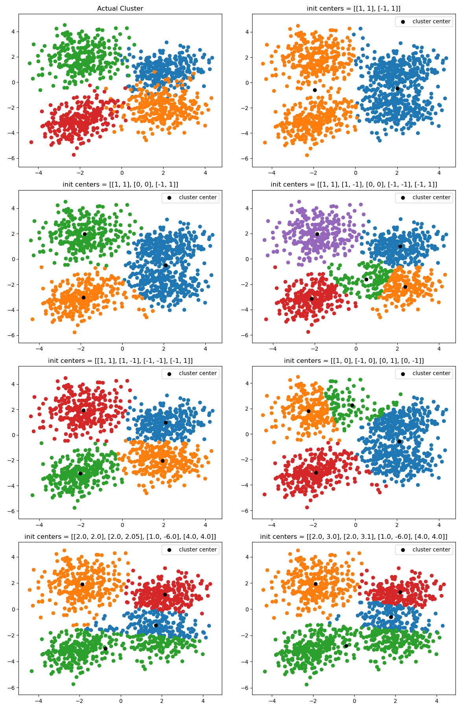
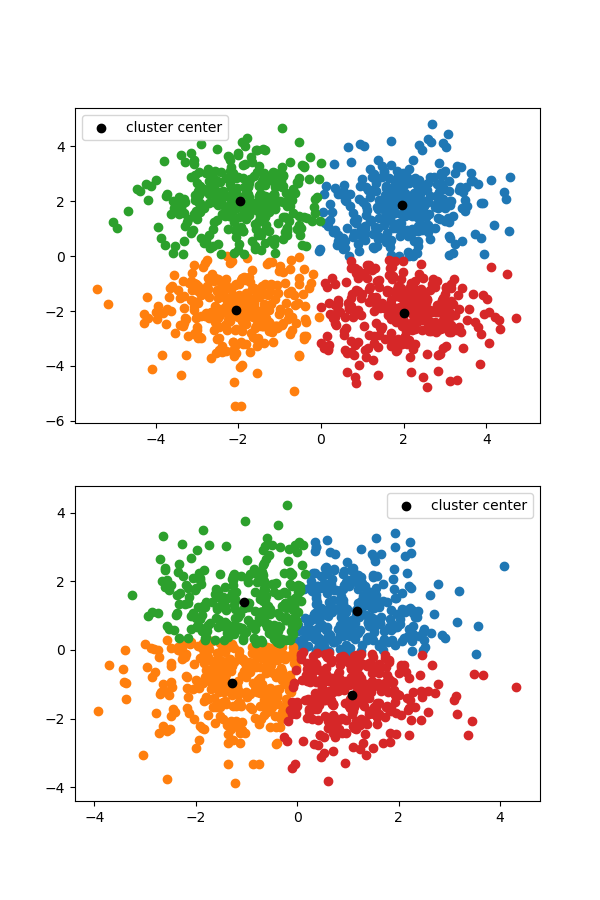
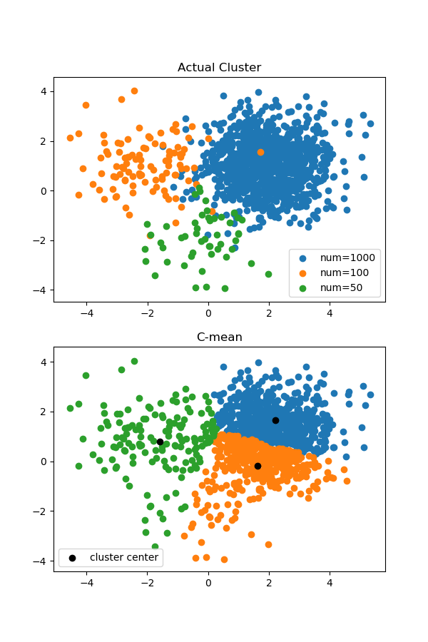

# 实验二 利用误差平方和函数集群

**Notice:** 数学公式在 Typora 中正常显示，需开启 `Markdown 扩展语法` 中的 `内联公式` （重新启动 Typora 生效）。也可以在 VSCode 中正常显示.

## 实验目的

1. 了解采用误差平方和函数的 C-mean 算法；
2. 了解数据分布与初始聚类的选择对结果的影响；
3. 了解此算法的优点与不足。

## 实验要求

1. 试就不同的初始分划，观察集群结果对初始分划的敏感性。
2. 比较各群样本都很密集并且彼此明显分开的情况与各群样本数目相差很大时，误差平方和集群效果，了解误差平方和准则函数集群的优势和缺陷。
3. 试对算法进行适当改进使其可以对样本数目相差很大的情况进行集群，用文字叙述改进的思路。
4. 给出以上各种情况的图形结果，撰写实验报告。

## 实验原理

C-mean 聚类算法是指定初始聚类中心，在聚类过程中不断更新中心且位置聚类中心数不变的算法。

本实验采用的是其第二种实现，即使用误差平方和准则函数来控制聚类过程。

设共有 $c$ 类，第 $i$ 类记为 $\mathbf{X}_i=\{\mathbf{x}_{i,1},\cdots,\mathbf{x}_{i,n_i}\}$, 其聚类中心记为 $\mathbf{C}_i$

定义误差平方和为

$$J=\sum_{i=1}^c \sum_{j=1}^{n_i} \|\mathbf{x}_{i,j} - \mathbf{C}_i\|^2$$

假设将 $\mathbf{X}_i$ 中第 $l$ 个样本 $\mathbf{x}_{i,l}$ 移动到 $\mathbf{X}_j$ 中，则聚类中心的变化为

$$\Delta \mathbf{C}_i=\cfrac{1}{n_i-1}\left( n_i \mathbf{C}_i - \mathbf{x}_{i,l} \right)- \mathbf{C}_i=\cfrac{1}{n_i-1}\left( \mathbf{C}_i-\mathbf{x}_{i,l} \right)$$

$$\Delta \mathbf{C}_j=\cfrac{1}{n_j+1}\left( n_j \mathbf{C}_j + \mathbf{x}_{i,l} \right)- \mathbf{C}_j=-\cfrac{1}{n_j+1}\left( \mathbf{C}_j-\mathbf{x}_{i,l} \right)$$

计算得引起误差平方和函数变化为

$$\Delta J_i =- \cfrac{n_i}{n_i-1}\| \mathbf{x}_{i,l}-\mathbf{C}_i \|^2$$

$$\Delta J_j = \cfrac{n_j}{n_i+1}\| \mathbf{x}_{i,l}-\mathbf{C}_j \|^2$$

$$\Delta J=\Delta J_i+\Delta J_j= -\left( \cfrac{n_i}{n_i-1}\| \mathbf{x}_{i,l}-\mathbf{C}_i \|^2 - \cfrac{n_j}{n_j+1}\| \mathbf{x}_{i,l}-\mathbf{C}_j \|^2 \right)$$

令

$$\delta_{i,j,l}=\cfrac{n_i}{n_i-1}\| \mathbf{x}_{i,l}-\mathbf{C}_i \|^2 - \cfrac{n_j}{n_j+1}\| \mathbf{x}_{i,l}-\mathbf{C}_j \|^2, i\neq j$$

当存在 $\delta_{i,j,l}>0$ 时，选择 $\delta_{i,j,l}$ 最大时的 $i_{max},j_{max},l_{max}$, 把 $\mathbf{x}_{i,l}$ 移动到 $\mathbf{X}_j$ 中，然后重复上述过程，直到所有 $\delta_{i,j,l} \leq 0$， 则聚类终止。

## 实验实现

实验的数据集通过生成几个正态分布的点集组合获得（指定不同的 $\mu$, $\sigma$, $n$），具体代码如下：

```python
# 获得正态分布的随机点集
def get_random_cluster(mu: np.ndarray, sigma: np.ndarray, num: int) \
        -> np.ndarray:
    dim = mu.shape[0]
    assert mu.shape == (dim,)
    assert sigma.shape == (dim, dim)
    assert num > 0
    x = np.random.randn(num, dim) @ sigma + mu
    assert x.shape == (num, dim)
    return x
```

C-mean 聚类的算法完全按照书上实现：

```python
# c-mean 聚类
def c_mean(samples: np.ndarray, init_centers: np.ndarray, iter_limit: int = math.inf) \
        -> Tuple[List[np.ndarray], np.ndarray]:
    n, dim = samples.shape
    c = init_centers.shape[0]
    assert init_centers.shape == (c, dim)
    assert iter_limit > 0

    # 初始聚类中心
    centers = np.array(init_centers, dtype=float)
    # 计算每个样本到每个聚类中心的距离平方
    dist = np.empty(shape=(n, c), dtype=float)
    for i in range(c):
        dist[:, i] = ((samples - centers[i, :]) ** 2).sum(axis=1)
    # 计算初始分类
    labels: np.ndarray = dist.argmin(axis=1)
    # 更新聚类中心
    size = np.array([(labels == i).sum() for i in range(c)])
    for i in range(c):
        if size[i] == 0:
            centers[i, :] = 0
        else:
            centers[i, :] = samples[labels == i].mean(axis=0)
    # 每个类别分到的样本数
    size = np.array([(labels == i).sum() for i in range(c)])

    # 计算 J
    def get_J() -> float:
        return sum((dist[labels == i, i]).sum() for i in range(c))

    # 类进行变化时误差函数的变化
    delta = np.full(shape=(c, c, n), dtype=float, fill_value=np.nan)

    # 更新 delta
    def update_delta(i: int):
        assert 0 <= i < c
        n_i = size[i]
        if n_i == 1:
            # 如果 i 类只有一个元素，则移出不减小 J
            delta[i, :, :n_i] = -(size / (size + 1) * dist[labels == i, :]).T
        elif n_i >= 2:
            delta[i, :, :n_i] = \
                (n_i / (n_i - 1) * dist[labels == i, i:i + 1]
                 - size / (size + 1) * dist[labels == i, :]).T
        delta[i, :, n_i:] = -np.inf  # 阻止移动不存在的元素
        delta[i, i, :] = -np.inf  # 阻止自己向自己移动

    # 初始化 delta
    for i in range(c):
        update_delta(i)

    iter: int = 0
    while iter <= iter_limit:  # 迭代上限
        # 找到最大的 delta
        i_max, j_max, l_max = np.unravel_index(delta.argmax(), delta.shape)
        # 无法使误差平方和再减小
        if delta[i_max, j_max, l_max] <= 0:
            break
        # 寻找要移动的类的位置
        index = 0
        index_in_cluster = 0
        while index < n:
            if labels[index] == i_max:
                if index_in_cluster == l_max:
                    break
                index_in_cluster += 1
            index += 1
        # 移动类
        labels[index] = j_max
        # 更新聚类中心
        assert size[i_max] > 0
        if size[i_max] > 1:
            centers[i_max] += 1 / (size[i_max] - 1) * (centers[i_max] - samples[index])
        else:
            centers[i_max] = 0
        centers[j_max] -= 1 / (size[j_max] + 1) * (centers[j_max] - samples[index])
        # 更新其他数据
        size[i_max] -= 1
        size[j_max] += 1
        dist[:, i_max] = ((samples - centers[i_max]) ** 2).sum(axis=1)
        dist[:, j_max] = ((samples - centers[j_max]) ** 2).sum(axis=1)
        # 更新 delta
        update_delta(i_max)
        update_delta(j_max)

        iter += 1
        print(f'> iteration {iter}: J={get_J()}')

    return [np.array(samples[labels == i]) for i in range(c)], centers
```

### 不同的初始分划

生成有 4 个正态分布叠加而成的数据集，再分别指定聚类数为 $2,3,4,5$ 的情况进行聚类，再指定聚类数为 $4$ 但改变初始聚类中心也进行一次聚类。

### 比较各群样本都很密集并且彼此明显分开的情况

生成两组数据，一组的各类 $\mu$ 分得很开，另一组比较接近，分别聚类观察效果。

### 各群样本数目相差很大

生成 $3$ 个正态分布点集但 $n$ 相差很大，进行聚类并画图。

## 实验结论

### 不同的初始分划



如上图，按先行后列的顺序，前 4 张图片分别为：真实的类别划分、聚类数为 2,3,5 的情况下的输出。

后 4 张图的聚类数都是 4, 但初始聚类中心不一样。

可以看到不同的类别数会对结果产生很大影响，聚类的一大难点就是确定合适的聚类数，会在很大程度上决定输出质量。

确定了类别数，初始聚类中心的选择同样重要，聚类结果对初始选择敏感，选择不当就会出现后 3 张图中的不恰当输出。

### 比较各群样本都很密集并且彼此明显分开的情况



可以看出样本分离比较明显时，聚类能给出很好的结果，但各类样本分布重叠度高时，C-mean 的能力有限。

### 各群样本数目相差很大



如图，三种样本数分别为 50, 100, 1000. 可以看到聚类算法似乎被样本多的一类主导，而忽略掉样本少的类。我的理解是 C-mean 倾向于把样本多且分布比较广的类拆成多个子类，因为这样会有效减少 $J$ （多个中心减小到聚类中心的距离）, 这是其缺陷所在。

优势：

- 实现简单
- 在各类数量接近，区分较明显的情况下十分有效

缺点：

- 类别数人为设定且不能调整，如何设定会对结果造成影响
- 对初始聚类中心的选定较为敏感
- 算法难以并行化
- 难以应对各类数量悬殊的情况
- 样本比较松散时也难以应对

### 试对算法进行适当改进使其可以对样本数目相差很大的情况进行集群，用文字叙述改进的思路

1. 先用普通方法尝试聚类；
2. 对输出的类，把每类的聚类中心做输入，再做聚类；
3. 把分到同一类中的聚类中心对应的类合并。

## 完整代码

```python
from typing import Tuple, List, Any, Callable, Union
import numpy as np
import matplotlib.pyplot as plt
import math
import random


# 获得正态分布的随机点集
def get_random_cluster(mu: np.ndarray, sigma: np.ndarray, num: int) \
        -> np.ndarray:
    dim = mu.shape[0]
    assert mu.shape == (dim,)
    assert sigma.shape == (dim, dim)
    assert num > 0
    x = np.random.randn(num, dim) @ sigma + mu
    assert x.shape == (num, dim)
    return x


# c-mean 聚类
def c_mean(samples: np.ndarray, init_centers: np.ndarray, iter_limit: int = math.inf) \
        -> Tuple[List[np.ndarray], np.ndarray]:
    n, dim = samples.shape
    c = init_centers.shape[0]
    assert init_centers.shape == (c, dim)
    assert iter_limit > 0

    # 初始聚类中心
    centers = np.array(init_centers, dtype=float)
    # 计算每个样本到每个聚类中心的距离平方
    dist = np.empty(shape=(n, c), dtype=float)
    for i in range(c):
        dist[:, i] = ((samples - centers[i, :]) ** 2).sum(axis=1)
    # 计算初始分类
    labels: np.ndarray = dist.argmin(axis=1)
    # 更新聚类中心
    size = np.array([(labels == i).sum() for i in range(c)])
    for i in range(c):
        if size[i] == 0:
            centers[i, :] = 0
        else:
            centers[i, :] = samples[labels == i].mean(axis=0)
    # 每个类别分到的样本数
    size = np.array([(labels == i).sum() for i in range(c)])

    # 计算 J
    def get_J() -> float:
        return sum((dist[labels == i, i]).sum() for i in range(c))

    # 类进行变化时误差函数的变化
    delta = np.full(shape=(c, c, n), dtype=float, fill_value=np.nan)

    # 更新 delta
    def update_delta(i: int):
        assert 0 <= i < c
        n_i = size[i]
        if n_i == 1:
            # 如果 i 类只有一个元素，则移出不减小 J
            delta[i, :, :n_i] = -(size / (size + 1) * dist[labels == i, :]).T
        elif n_i >= 2:
            delta[i, :, :n_i] = \
                (n_i / (n_i - 1) * dist[labels == i, i:i + 1]
                 - size / (size + 1) * dist[labels == i, :]).T
        delta[i, :, n_i:] = -np.inf  # 阻止移动不存在的元素
        delta[i, i, :] = -np.inf  # 阻止自己向自己移动

    # 初始化 delta
    for i in range(c):
        update_delta(i)

    iter: int = 0
    while iter <= iter_limit:  # 迭代上限
        # 找到最大的 delta
        i_max, j_max, l_max = np.unravel_index(delta.argmax(), delta.shape)
        # 无法使误差平方和再减小
        if delta[i_max, j_max, l_max] <= 0:
            break
        # 寻找要移动的类的位置
        index = 0
        index_in_cluster = 0
        while index < n:
            if labels[index] == i_max:
                if index_in_cluster == l_max:
                    break
                index_in_cluster += 1
            index += 1
        # 移动类
        labels[index] = j_max
        # 更新聚类中心
        assert size[i_max] > 0
        if size[i_max] > 1:
            centers[i_max] += 1 / (size[i_max] - 1) * (centers[i_max] - samples[index])
        else:
            centers[i_max] = 0
        centers[j_max] -= 1 / (size[j_max] + 1) * (centers[j_max] - samples[index])
        # 更新其他数据
        size[i_max] -= 1
        size[j_max] += 1
        dist[:, i_max] = ((samples - centers[i_max]) ** 2).sum(axis=1)
        dist[:, j_max] = ((samples - centers[j_max]) ** 2).sum(axis=1)
        # 更新 delta
        update_delta(i_max)
        update_delta(j_max)

        iter += 1
        print(f'> iteration {iter}: J={get_J()}')

    return [np.array(samples[labels == i]) for i in range(c)], centers


if __name__ == '__main__':
    fig: plt.Figure
    sigma = np.array([(1, 0), (0, 1)])

    # 不同的初始化分
    x1 = get_random_cluster(np.array((2, 1)), np.array([(0.9, 0.1), (0.1, 0.9)]), num=300)
    x2 = get_random_cluster(np.array((2, -2)), np.array([(1, 0), (0, 1)]), num=300)
    x3 = get_random_cluster(np.array((-2, 2)), np.array([(1, 0), (0, 1)]), num=300)
    x4 = get_random_cluster(np.array((-2, -3)), np.array([(0.9, 0.2), (0.2, 0.9)]), num=300)
    x = np.vstack([x1, x2, x3, x4])

    init_centers_list = [
        np.array([(1, 1), (-1, 1)]),
        np.array([(1, 1), (0, 0), (-1, 1)]),
        np.array([(1, 1), (1, -1), (-1, -1), (-1, 1)]),
        np.array([(2, 3), (2, 3.1), (1, -6), (4, 4)]),
        np.array([(1, 1), (1, -1), (0, 0), (-1, -1), (-1, 1)]),
    ]

    fig, axes = plt.subplots(3, 2)
    # 正确划分
    for x1 in [x1, x2, x3, x4]:
        axes[0, 0].scatter(x1[:, 0], x1[:, 1])
    axes[0, 0].set_title('Actual Cluster')

    for i in range(1, 6):
        ax = axes[i // 2, i % 2]
        init_centers = init_centers_list[i - 1]
        clusters, centers = c_mean(x, init_centers)
        for cluster in clusters:
            ax.scatter(cluster[:, 0], cluster[:, 1])
        ax.scatter(centers[:, 0], centers[:, 1],
                   c='black', label='cluster center')
        ax.legend(loc='best')
        ax.set_title(f'init centers = {init_centers.tolist()}')

    fig.set_size_inches(12, 4.5 * 3)
    # fig.show()
    fig.savefig('../pics/lab2-1.png')

    # 各类分离比较明显与不明显的
    fig, axes = plt.subplots(2, 1)

    x1 = get_random_cluster(np.array((2, 2)), sigma, num=300)
    x2 = get_random_cluster(np.array((2, -2)), sigma, num=300)
    x3 = get_random_cluster(np.array((-2, 2)), sigma, num=300)
    x4 = get_random_cluster(np.array((-2, -2)), sigma, num=300)
    x = np.vstack([x1, x2, x3, x4])
    clusters, centers = c_mean(x, np.array([(1, 0), (-1, 0), (0, 1), (0, -1)]))
    for cluster in clusters:
        axes[0].scatter(cluster[:, 0], cluster[:, 1])
    axes[0].scatter(centers[:, 0], centers[:, 1], color='black', label='cluster center')
    axes[0].legend(loc='best')

    x1 = get_random_cluster(np.array((1, 1)), sigma, num=300)
    x2 = get_random_cluster(np.array((1, -1)), sigma, num=300)
    x3 = get_random_cluster(np.array((-1, 1)), sigma, num=300)
    x4 = get_random_cluster(np.array((-1, -1)), sigma, num=300)
    x = np.vstack([x1, x2, x3, x4])
    clusters, centers = c_mean(x, np.array([(1, 0), (-1, 0), (0, 1), (0, -1)]))
    for cluster in clusters:
        axes[1].scatter(cluster[:, 0], cluster[:, 1])
    axes[1].scatter(centers[:, 0], centers[:, 1], color='black', label='cluster center')
    axes[1].legend(loc='best')

    fig.set_size_inches(6, 9)
    # fig.show()
    fig.savefig('../pics/lab2-2.png')

    # 各类别数目相差很大
    x1 = get_random_cluster(np.array((2, 1)), sigma, num=1000)
    x2 = get_random_cluster(np.array((-2, 1)), sigma, num=100)
    x3 = get_random_cluster(np.array((0, -2)), sigma, num=50)
    x = np.vstack([x1, x2, x3])
    clusters, centers = c_mean(x, np.array([(1, 1), (0, 0), (-1, -1)]))
    # 正确划分
    fig, axes = plt.subplots(2, 1)
    for x in [x1, x2, x3]:
        axes[0].scatter(x[:, 0], x[:, 1], label=f'num={len(x)}')
    axes[0].legend(loc='best')
    axes[0].set_title('Actual Cluster')
    # c-mean 划分
    for cluster in clusters:
        axes[1].scatter(cluster[:, 0], cluster[:, 1])
    axes[1].scatter(centers[:, 0], centers[:, 1], color='black', label='cluster center')
    axes[1].legend(loc='best')
    axes[1].set_title('C-mean')
    fig.set_size_inches(6, 9)
    # fig.show()
    fig.savefig('../pics/lab2-3.png')
```
