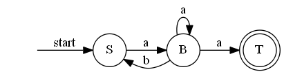
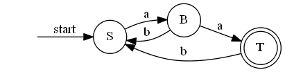

# 实验三 利用有限自动机算法的正规语言的句法分析

## 实验目的

1. 了解正规语言及其分类
2. 了解 3 型正规语言转化成 FA 的算法
3. 了解 NFA 转化成 DFA 的方法
4. 学会 DFA 的编程实现

## 实验要求

给定正规文法

$G=\{V_N,V_T,P,S\}$

$V_N=\{S,B\}$

$V_T=\{a,b\}$

$\begin{aligned}
P:\ &S \to aB \\
    &B \to bS \\
    &B \to aB \\
    &B \to a
\end{aligned}$

构造确定的有限自动机后，编制确定的有限自动机算法，并检验 X=`aababaaababaaa` 和 X=`ababaababaaba` 是否能被 G 接受。

1. 总结出能被接受的链的一般特征。
2. 分析正规文法和确定的有限自动机的联系并撰写实验报告。

## 实验原理

### 3 型文法

3 型文法是要求产生式只能为 $A\to aB$ 或 $A\to a$ 的文法, 其中 $a\in V_T$, $A,B \in V_N$.

由 3 型文法产生的语言成为 3 型语言.

不难看出本实验给出的文法正是 3 型文法.

### 有限状态自动机 FA

有限状态自动机定义为五元系统 $M=(\Sigma,Q,\delta,q_0,F)$

- $\Sigma$: 输入符号的有限集合
- $Q$: 状态的有限集合
- $\delta$: 状态转换函数是 $Q\times \Sigma$ 到 $Q$ 的幂集一种映射
- $q_0$: 初始状态 $q_0\in Q$
- $F$: 终止状态集合

有限自动机一开始处于 $q_0$ 状态, 每读入 $\Sigma$ 中的一个符号则根据 $\delta$ 转化到下一个状态. 若符号读取完毕且有限自动机处于 $F$ 中的某个状态, 则说自动机接受这个序列, 否则说自动机不接受这个序列.

### 3 型文法到 FA 的转化

设 3 型文法 $(V_N,V_T,P,S)$, 则其到 FA 的转换步骤如下:

1. $\Sigma=V_T$
2. $F=T$
3. $Q=V_N \cup \{T\}$
4. $q_0=S$
5. 若 $P$ 中有 $B\to a$, 则 $T$ 加入到 $\delta(B,a)$
6. 若 $P$ 中有 $B\to aC$, 则 $C$ 加入到 $\delta(B,a)$
7. 对 $\forall a \in V_T$, 都有 $\delta(T,a)=\empty$

本实验的文法转化成的 FA 如下:

- $\Sigma=\{a,b\}$
- $F=T$
- $Q=\{S,B,T\}$
- $q_0=S$
- $\delta(S,a)=\{B\}$\
  $\delta(S,b)=\empty$\
  $\delta(B,a)=\{B,T\}$\
  $\delta(B,b)=\{S\}$\
  $\delta(T,a)=\empty$\
  $\delta(T,b)=\empty$

画成图如下:



### NFA 与 DFA

DFA 相比 NFA, 增加了 "每个状态输入一个符号时最多只能跳转到一个状态" 这一限制.

任意 NFA 一定存在与之等价的 DFA.

由于 DFA 的实现快捷且高效, 我们先把上述 NFA 转化成 DFA 在予以实现.

转化后的 DFA 如下:



## 实验实现

在 DFA 的实现程序中, 核心是一张转换表, 列出每个状态遇到每个输入字符时跳转到什么状态. 转换表的构建如下;

```python
def __init__(self) -> None:
    self.init_state = 'S'
    self.accept_state = 'T'
    self.trans_table = pd.DataFrame(
        index=pd.Index(data=['S', 'B', 'T']),
        columns=pd.Index(data=['a', 'b']),
        dtype=str
    )
    self.trans_table.loc['S', 'a'] = 'B'
    self.trans_table.loc['B', 'a'] = 'T'
    self.trans_table.loc['B', 'b'] = 'S'
    self.trans_table.loc['T', 'a'] = 'T'
    self.trans_table.loc['T', 'b'] = 'S'
```

输入一个字符串时, 只要从初始状态开始, 根据每个字符依次进行跳转. 如果中途出现无法跳转的情况 ($\delta=\empty$) 或者最后不是接收状态, 则不接受这个字符串, 否则就接受. 实现代码如下:

```python
def judge(self, s: str):
    state = self.init_state
    for c in s:
        goto = self.trans_table.loc[state, c]
        if pd.isna(goto):
            return False
        else:
            state = goto
    return state == self.accept_state
```

## 实验结论

程序的输出为

```python
True
False
```

表明 X=`aababaaababaaa` 被接受但 X=`ababaababaaba` 不被接受.

根据 DFA, 不难得出此文法表示的是正规式 `a(a|ab)*a` 所接受的语言, 只要是能被此正规式匹配的串, 都能被接受.

正规文法 G 与 DFA 的关系:

1. 每一个正规文法 G 有能与之对应的不确定有限状态机相互转化
2. 存在确定的有限状态机和不确定的有限状态机等价
3. 对每一个正规表达式，有与子等价的确定有限状态机

由上述三条定理，易知正规文法和正规表达式等价，并且存在确定的有限自动状态机和正规文法等价。因而对判断某模式能否被某正规文法接受一种行之有效的方法是，构造与正规文法等价的确定有限自动状态机进行句法分析。

## 完整代码

```python
import pandas as pd


class FA:
    trans_table: pd.DataFrame
    init_state: str
    accept_state: str

    def __init__(self) -> None:
        self.init_state = 'S'
        self.accept_state = 'T'
        self.trans_table = pd.DataFrame(
            index=pd.Index(data=['S', 'B', 'T']),
            columns=pd.Index(data=['a', 'b']),
            dtype=str
        )
        self.trans_table.loc['S', 'a'] = 'B'
        self.trans_table.loc['B', 'a'] = 'T'
        self.trans_table.loc['B', 'b'] = 'S'
        self.trans_table.loc['T', 'a'] = 'T'
        self.trans_table.loc['T', 'b'] = 'S'
        # print(self.trans_table)

    def judge(self, s: str):
        state = self.init_state
        for c in s:
            goto = self.trans_table.loc[state, c]
            if pd.isna(goto):
                return False
            else:
                state = goto
        return state == self.accept_state


if __name__ == '__main__':
    fa = FA()
    print(fa.judge('aababaaababaaa'))
    print(fa.judge('ababaababaaba'))
```
